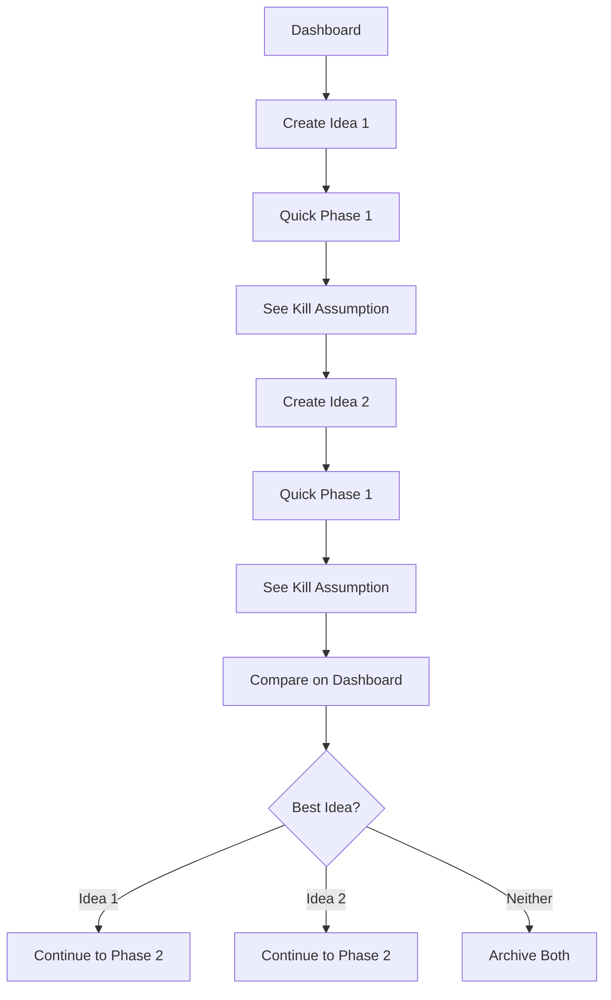
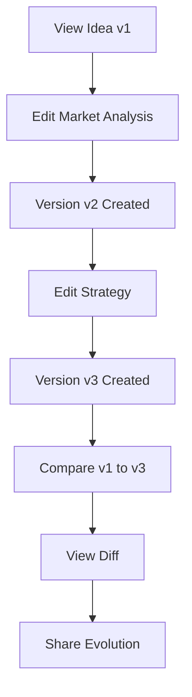

# UX Design Specification: Startup Validator Platform

**Author:** Major project
**Date:** 2026-01-18
**Status:** Complete

---

## Executive Summary

### Project Vision

Startup Validator is a **decision-version engine** that transforms messy startup ideas into structured, investor-ready outputs through a 3-phase validation workflow. The platform differentiates through four key innovations:

1. **Decision Engine Architecture** — Produces structured decisions, not chat conversations
2. **Version Control for Ideas** — Immutable history with Git-like tracking
3. **Section-Level Editing** — Granular control preserving unchanged content
4. **Kill Assumption Focus** — Surfaces the single biggest risk per idea

### Target Users

| Persona | Profile | Primary Need | UX Priority |
|---------|---------|--------------|-------------|
| **Alex (First-Timer)** | First-time founder, 25-35, has ideas but no validation experience | Guided process, education | Onboarding, tooltips, clear next steps |
| **Jordan (Serial)** | Experienced founder, 30-45, multiple ideas, values speed | Fast iteration, version control | Keyboard shortcuts, quick actions, diff view |
| **Morgan (Fundraiser)** | Technical founder, 28-45, investor meeting soon | Quick pitch deck, professional output | PDF quality, fast Phase 2-3 flow |
| **Sam (Explorer)** | Creative thinker, 22-40, 20+ ideas in notes | Organization, quick comparison | Dashboard filters, idea cards, status badges |

**User Context:**
- **Tech Level:** Intermediate to advanced (founders, PMs, designers)
- **Primary Device:** Desktop-first, mobile for quick checks
- **Usage Context:** Late-night ideation, coffee shop iteration, pre-meeting prep

### Key Design Challenges

1. **Phase Progression Clarity** — 3-phase workflow with locked states must be immediately understandable
2. **Section Editing Mental Model** — Novel interaction pattern requires trust-building UX
3. **Version Control Comprehension** — Git-like concepts need simplified visual metaphors
4. **Cascade Invalidation Communication** — Clear feedback when Phase 1 changes affect Phase 2-3
5. **Information Density Management** — Multiple outputs per phase must remain scannable

### Design Opportunities

1. **Progressive Disclosure** — Gradual complexity revelation based on user expertise
2. **Trust-Building Animations** — Section-specific regeneration animation builds confidence
3. **Kill Assumption Prominence** — Make this the hero moment of Phase 1 validation
4. **Version Timeline Visualization** — Shareable "idea evolution" visual for social proof
5. **Empty State Storytelling** — First idea flow teaches methodology while providing value

---

## Core User Experience

### Defining Experience

**The Core Interaction:** "Enter your messy startup idea, get structured validation with your biggest risk identified in minutes."

This is the Tinder swipe, the Instagram filter, the Spotify play button for Startup Validator. Users will describe it to friends as: "It told me what could kill my idea in 5 minutes."

**Success Moment:** When a user sees their Kill Assumption clearly stated — the single assumption that, if false, would invalidate their entire idea. This is the "aha" moment that creates word-of-mouth.

### User Mental Model

**Current Solutions Users Know:**
- ChatGPT/Claude for brainstorming (conversational, no structure)
- Pitch deck templates (manual, time-consuming)
- Spreadsheets for idea tracking (disorganized)
- Note apps for idea capture (no validation)

**Mental Model We're Building:**
- Ideas are documents that evolve through versions
- Validation is a journey through 3 phases (not a one-shot response)
- Each section can be refined independently
- History is preserved and comparable

**Key Expectation Management:**
- Users expect chat-based AI → We deliver structured outputs
- Users expect all-or-nothing regeneration → We preserve unchanged sections
- Users expect ephemeral responses → We save version history

### Success Criteria

| Moment | Success Indicator | UX Implication |
|--------|-------------------|----------------|
| **First Value** | User sees structured Phase 1 output in <5 minutes | Minimal friction to first generation |
| **Trust Moment** | User edits one section and sees only that section regenerate | Animation shows preservation clearly |
| **Power Moment** | User compares v1 to v3 and sees their thinking evolution | Version diff must be visually obvious |
| **Completion Moment** | User downloads pitch deck PDF | PDF must look professional and complete |

### Experience Principles

1. **Decisions, Not Conversations** — Every interaction produces a concrete, structured output
2. **Progressive Trust** — Show users their data is safe through visible version history
3. **Guided Freedom** — Provide structure but allow section-level customization
4. **Celebrate Progress** — Mark phase completions with subtle celebration moments
5. **Fail Forward** — Errors always suggest next actions, never dead ends

---

## Desired Emotional Response

### Primary Emotional Goals

| Phase | Desired Emotion | Design Approach |
|-------|-----------------|-----------------|
| **Discovery** | Curiosity + Hope | "This might actually help me" — clear value prop, easy entry |
| **First Generation** | Surprise + Relief | "This is exactly what I needed" — structured output exceeds expectations |
| **Editing** | Control + Confidence | "I can refine this without losing progress" — visible preservation |
| **Completion** | Accomplishment + Clarity | "I know what to do next" — clear action items, downloadable results |

### Emotional Journey Mapping

```
Discovery → Anticipation → Surprise → Control → Accomplishment
    ↓           ↓            ↓          ↓            ↓
"Maybe?"   "Show me"    "Wow!"    "I got this"  "Done!"
```

### Micro-Emotions

| Interaction | Target Emotion | Anti-Emotion to Avoid |
|-------------|----------------|----------------------|
| Entering idea | Ease, low stakes | Overwhelm, pressure |
| Waiting for generation | Engaged anticipation | Anxiety, impatience |
| Reading Kill Assumption | Clarity, gratitude | Fear, defensiveness |
| Editing a section | Precision, control | Confusion, risk |
| Comparing versions | Pride, insight | Regret, loss |
| Downloading PDF | Accomplishment | Disappointment |

### Emotional Design Principles

1. **Never Make Users Feel Dumb** — Clear labels, helpful tooltips, no jargon
2. **Build Trust Through Transparency** — Show what's happening, why, and what's preserved
3. **Celebrate Small Wins** — Phase completions, version saves, successful edits
4. **Handle Failures Gracefully** — Errors are opportunities to help, not dead ends
5. **Respect Time** — Show progress, estimate durations, never leave users waiting blind

---

## UX Pattern Analysis & Inspiration

### Inspiring Products Analysis

| Product | What They Do Well | Applicable Pattern |
|---------|-------------------|-------------------|
| **Notion** | Database views (table, kanban, list) | Idea dashboard view switching |
| **Figma** | Version history sidebar | Version comparison UI |
| **GitHub** | Diff view for changes | Section change comparison |
| **Linear** | Clean, fast, keyboard-first | Power user shortcuts |
| **Stripe** | Progressive disclosure | Phase complexity revelation |
| **Vercel** | Deploy status indicators | Phase status badges |

### Transferable UX Patterns

**Navigation Patterns:**
- Notion-style sidebar for idea history
- Horizontal stepper for phase progression (Stripe checkout)
- Breadcrumbs for deep navigation context

**Interaction Patterns:**
- Figma-style version history slider
- GitHub-style diff highlighting for changes
- Linear-style keyboard shortcuts for power users

**Visual Patterns:**
- Vercel-style status badges (building, ready, error)
- Stripe-style card sections with clear hierarchy
- Notion-style clean typography with good whitespace

### Anti-Patterns to Avoid

| Anti-Pattern | Why It Fails | Our Alternative |
|--------------|--------------|-----------------|
| Chat-based responses | No structure, ephemeral | Structured sections with persistence |
| All-or-nothing regeneration | Loses user refinements | Section-level editing with preservation |
| Wall of text | Overwhelms, unreadable | Scannable cards with clear hierarchy |
| No version history | Loses thinking evolution | Full immutable version tracking |
| Hidden loading states | Creates anxiety | Transparent progress indicators |

### Design Inspiration Strategy

**Adopt:**
- Notion's view switching for idea dashboard
- Figma's version history UI paradigm
- Linear's keyboard-first power user experience
- Vercel's clean status indicators

**Adapt:**
- GitHub's diff view → simplified for non-developers
- Stripe's progressive disclosure → for 3-phase complexity

**Avoid:**
- Chat interfaces for core validation flow
- Complex navigation hierarchies
- Overwhelming data density

---

## Design System Foundation

### Design System Choice

**Selected:** Shadcn UI + Tailwind CSS

**Rationale:**
1. **Customization** — Full control over components while maintaining consistency
2. **Modern Stack** — React-native, works perfectly with our tech stack
3. **Accessibility** — Built-in ARIA support and keyboard navigation
4. **Performance** — No runtime overhead, compiles to plain CSS
5. **Community** — Active development, excellent documentation

### Implementation Approach

```
Base Layer:     Tailwind CSS (utility-first styling)
Component Layer: Shadcn UI (accessible, customizable components)
Custom Layer:   Project-specific components built on Shadcn primitives
```

### Customization Strategy

**Theme Tokens:**
- Colors: Custom semantic palette (see Visual Foundation)
- Typography: Inter for UI, system fonts for performance
- Spacing: 4px base unit, 8px rhythm
- Border Radius: 8px default, 12px for cards

**Component Extensions:**
- Phase Stepper (custom)
- Idea Card (custom)
- Section Editor (custom)
- Version Comparison (custom)

---

## Visual Design Foundation

### Color System

**Brand Colors:**

| Token | Light Mode | Dark Mode | Usage |
|-------|------------|-----------|-------|
| `primary` | `#2563EB` (Blue 600) | `#3B82F6` (Blue 500) | Primary actions, links |
| `primary-foreground` | `#FFFFFF` | `#FFFFFF` | Text on primary |
| `secondary` | `#F1F5F9` (Slate 100) | `#1E293B` (Slate 800) | Secondary actions |
| `accent` | `#8B5CF6` (Violet 500) | `#A78BFA` (Violet 400) | Highlights, badges |

**Semantic Colors:**

| Token | Color | Usage |
|-------|-------|-------|
| `success` | `#10B981` (Emerald 500) | Phase complete, success states |
| `warning` | `#F59E0B` (Amber 500) | Needs attention, invalidated |
| `error` | `#EF4444` (Red 500) | Errors, critical risks |
| `info` | `#3B82F6` (Blue 500) | Informational states |

**Phase Status Colors:**

| State | Color | Usage |
|-------|-------|-------|
| Locked | `#94A3B8` (Slate 400) | Phase not yet accessible |
| Active | `#2563EB` (Blue 600) | Current working phase |
| Complete | `#10B981` (Emerald 500) | Phase confirmed |
| Invalidated | `#F59E0B` (Amber 500) | Needs regeneration |

### Typography System

**Font Stack:**
```css
--font-sans: 'Inter', -apple-system, BlinkMacSystemFont, 'Segoe UI', sans-serif;
--font-mono: 'JetBrains Mono', 'Fira Code', monospace;
```

**Type Scale:**

| Token | Size | Weight | Line Height | Usage |
|-------|------|--------|-------------|-------|
| `h1` | 36px | 700 | 1.2 | Page titles |
| `h2` | 28px | 600 | 1.3 | Section headers |
| `h3` | 22px | 600 | 1.4 | Card headers |
| `h4` | 18px | 500 | 1.4 | Subsection headers |
| `body` | 16px | 400 | 1.6 | Body text |
| `small` | 14px | 400 | 1.5 | Secondary text |
| `caption` | 12px | 400 | 1.4 | Labels, timestamps |

### Spacing & Layout Foundation

**Spacing Scale (4px base):**
```
xs: 4px   | sm: 8px   | md: 16px  | lg: 24px
xl: 32px  | 2xl: 48px | 3xl: 64px | 4xl: 96px
```

**Layout Grid:**
- Desktop: 12-column grid, 24px gutters
- Tablet: 8-column grid, 16px gutters
- Mobile: 4-column grid, 16px gutters

**Content Width:**
- Max content: 1280px
- Readable content: 720px
- Narrow content: 480px

### Accessibility Considerations

**Contrast Requirements:**
- Normal text: 4.5:1 minimum (WCAG AA)
- Large text: 3:1 minimum
- UI components: 3:1 minimum

**Focus States:**
- Visible focus ring: 2px solid primary + 2px offset
- Focus within complex components clearly indicated

**Motion:**
- Respect `prefers-reduced-motion`
- All animations <300ms
- No auto-playing animations

---

## Design Direction Decision

### Chosen Direction: Clean Professional with Subtle Delight

**Visual Philosophy:**
- **Clean & Professional** — Builds trust for investor-facing outputs
- **Subtle Delight** — Micro-interactions that surprise without overwhelming
- **Information Dense** — Efficient use of space without feeling cramped
- **Progressive Disclosure** — Complexity revealed as users advance

**Key Visual Characteristics:**
- White/light backgrounds with subtle gradients
- Card-based layout with consistent shadows
- Clear visual hierarchy through typography and spacing
- Phase progression shown through color and iconography
- Celebration moments for completions (confetti on Phase 3)

### Design Rationale

1. **Trust First** — Founders sharing pitch decks need professional output
2. **Speed Perception** — Clean UI feels faster and more responsive
3. **Differentiation** — Competitors are either too playful or too clinical
4. **Scalability** — Clean base allows for feature additions without redesign

---

## User Journey Flows

### Journey 1: First-Time Idea Validation (Alex)

```mermaid
flowchart TD
    A[Landing Page] --> B{Signed In?}
    B -->|No| C[Sign Up / Login]
    B -->|Yes| D[Dashboard]
    C --> D
    D --> E[Click "New Idea"]
    E --> F[Enter Idea Description]
    F --> G[Click "Validate"]
    G --> H[Loading: Phase 1 Generation]
    H --> I[View Phase 1 Results]
    I --> J{Satisfied?}
    J -->|No| K[Edit Section]
    K --> L[Section Regenerates]
    L --> I
    J -->|Yes| M[Confirm Phase 1]
    M --> N[Phase 2 Unlocks]
    N --> O[Generate Phase 2]
    O --> P[View Business Model]
    P --> Q[Confirm Phase 2]
    Q --> R[Generate Phase 3]
    R --> S[View Pitch Deck]
    S --> T[Download PDF]
```

**Key UX Moments:**
- **F → G:** Idea input should feel low-stakes, encouraging
- **H:** Loading state shows what's happening ("Analyzing market...")
- **I:** Kill Assumption prominently displayed
- **K → L:** Only edited section shows loading state

### Journey 2: Rapid Multi-Idea Comparison (Jordan)



**Key UX Moments:**
- Dashboard shows Kill Assumption preview on cards
- Quick filtering by phase status
- Side-by-side comparison capability

### Journey 3: Version Iteration (Jordan)



**Key UX Moments:**
- Every edit auto-creates new version
- Version history accessible from sidebar
- Diff view highlights what changed

### Journey Patterns

**Navigation Patterns:**
- Sidebar for idea list (always visible on desktop)
- Horizontal stepper for phase progression
- Breadcrumbs: Dashboard > Idea Name > Phase N

**Decision Patterns:**
- Confirmation modals for phase locks
- Warning badges for invalidated phases
- Clear "Continue" CTAs after each phase

**Feedback Patterns:**
- Toast notifications for saves and errors
- Skeleton loading for content generation
- Progress indicators for longer operations

### Flow Optimization Principles

1. **Minimize Clicks to Value** — First generation in 2 clicks from dashboard
2. **Progressive Complexity** — Show advanced features (version comparison) after first use
3. **Always Save Progress** — Auto-save, no lost work ever
4. **Clear Exit Points** — Every screen has obvious next action or return path

---

## Component Strategy

### Design System Components (from Shadcn UI)

**Use As-Is:**
- Button (all variants)
- Input, Textarea
- Card, CardHeader, CardContent
- Dialog, AlertDialog
- Toast (Sonner)
- Dropdown Menu
- Avatar
- Badge
- Tabs
- Tooltip
- Skeleton

**Customize:**
- Form validation styling
- Color theme tokens
- Typography scale

### Custom Components

#### 1. Phase Stepper

**Purpose:** Show 3-phase progression with status indicators

**Anatomy:**
```
[1 Validation ✓] ─── [2 Business Model ●] ─── [3 Pitch Deck 🔒]
   Complete          Active (blue)           Locked (gray)
```

**States:**
- Locked (gray, lock icon)
- Active (blue, pulsing dot)
- Complete (green, checkmark)
- Invalidated (orange, warning icon)

**Variants:**
- Horizontal (default, desktop)
- Vertical (mobile)
- Compact (sidebar)

#### 2. Idea Card

**Purpose:** Display idea summary on dashboard with status at a glance

**Anatomy:**
```
┌────────────────────────────────────┐
│ [Idea Title]              v3  [⋮] │
│ ✓ ✓ ○  Status Badges              │
│                                    │
│ Kill Assumption: "Assumes users    │
│ will pay before trying..."         │
│                                    │
│ Modified 2 hours ago               │
└────────────────────────────────────┘
```

**States:**
- Default, Hover (subtle lift shadow)
- Selected (blue border)
- Needs Update (orange indicator)

#### 3. Section Editor

**Purpose:** Enable section-level editing with AI regeneration

**Anatomy:**
```
┌─ Market Feasibility ────────────────────┐
│                                    [✎] │
│ [Section Content Here]                  │
│                                         │
└─────────────────────────────────────────┘

When editing (drawer slides in from right):
┌─────────────────────────────────────────┐
│ Edit Market Feasibility            [×] │
│                                         │
│ Current Content:                        │
│ [Current text displayed]                │
│                                         │
│ Your Feedback:                          │
│ [Textarea for user input]               │
│                                         │
│ [Cancel]              [Regenerate]      │
└─────────────────────────────────────────┘
```

**States:**
- Default (hover reveals edit icon)
- Editing (drawer open)
- Regenerating (skeleton loading)
- Updated (brief highlight animation)

#### 4. Version Timeline

**Purpose:** Show version history with comparison capability

**Anatomy:**
```
Version History
─────────────────────────────────
● v3 (Current)    Today 2:30 PM
│ Changed: Strategy section
│
○ v2              Today 11:00 AM
│ Changed: Market Feasibility
│
○ v1              Yesterday
  Initial validation
─────────────────────────────────
[Compare v1 ↔ v3]
```

**Interactions:**
- Click version to view (read-only)
- Select two versions to compare
- Current version always highlighted

### Implementation Roadmap

**Phase 1 (MVP):**
- Phase Stepper
- Idea Card
- Section Editor (basic)

**Phase 2 (v1.1):**
- Version Timeline
- Diff View
- Advanced filters

**Phase 3 (v1.2):**
- Keyboard shortcuts
- Batch operations
- Export customization

---

## UX Consistency Patterns

### Button Hierarchy

| Level | Style | Usage | Example |
|-------|-------|-------|---------|
| **Primary** | Solid blue, white text | Main action per screen | "Validate Idea", "Continue to Phase 2" |
| **Secondary** | Outline, blue text | Alternative actions | "Save Draft", "View History" |
| **Ghost** | Text only, blue | Tertiary actions | "Cancel", "Back" |
| **Destructive** | Solid red | Dangerous actions | "Delete Idea" |

**Button Rules:**
- One primary button per view
- Destructive actions require confirmation
- Icons optional, left-aligned when present

### Feedback Patterns

**Toast Notifications (Sonner):**

| Type | Color | Duration | Example |
|------|-------|----------|---------|
| Success | Green | 3s | "Phase 1 saved successfully" |
| Error | Red | 5s + dismiss | "Failed to generate. Retry?" |
| Warning | Orange | 4s | "Phase 2 needs regeneration" |
| Info | Blue | 3s | "New version created: v4" |

**Inline Feedback:**
- Form validation: Red border + error message below field
- Loading: Skeleton placeholder matching content shape
- Empty: Illustration + helpful message + CTA

### Form Patterns

**Input States:**
```
Default:  Gray border
Focus:    Blue border + subtle glow
Error:    Red border + error text below
Disabled: Gray background, muted text
```

**Validation Timing:**
- Validate on blur (not on every keystroke)
- Show errors after first submission attempt
- Clear errors when user starts fixing

**Form Layout:**
- Labels above inputs
- Helper text below inputs (gray, small)
- Required indicator: red asterisk

### Navigation Patterns

**Primary Navigation:**
- Sidebar (desktop): Always visible, collapsible
- Bottom nav (mobile): 4 items max
- Top bar: Logo, user menu, global actions

**Contextual Navigation:**
- Breadcrumbs for depth > 2 levels
- Back button in header for modals/drawers
- Phase stepper for validation workflow

### Empty States

| Context | Illustration | Message | CTA |
|---------|--------------|---------|-----|
| No ideas | Lightbulb | "Your next big idea starts here" | "Create First Idea" |
| No search results | Magnifying glass | "No ideas match your search" | "Clear Filters" |
| Empty phase | Document | "Ready to validate" | "Generate Analysis" |
| No versions | Clock | "This is v1 - make edits to create versions" | — |

### Loading States

**Content Loading:**
- Skeleton placeholders matching content shape
- Animate shimmer left-to-right
- Show for any load >300ms

**Action Loading:**
- Button shows spinner, disabled
- Text changes: "Generating..."
- Phase-specific messages: "Analyzing market data..."

**Full Page Loading:**
- Centered spinner with app logo
- Used only for initial app load

---

## Responsive Design & Accessibility

### Responsive Strategy

**Desktop (>1024px):**
- Full sidebar + main content layout
- Horizontal phase stepper
- Multi-column card grid (3 columns)
- Side-by-side version comparison

**Tablet (640-1024px):**
- Collapsible sidebar (overlay)
- Horizontal phase stepper (compact)
- 2-column card grid
- Stacked version comparison

**Mobile (<640px):**
- Bottom navigation
- Vertical phase stepper
- Single column cards
- Full-screen modals
- Drawer-based editing

### Breakpoint Strategy

```css
/* Mobile First */
/* Default: Mobile (<640px) */

@media (min-width: 640px) {
  /* Tablet */
}

@media (min-width: 1024px) {
  /* Desktop */
}

@media (min-width: 1280px) {
  /* Large Desktop */
}
```

**Tailwind Classes:**
- `sm:` = 640px+
- `md:` = 768px+
- `lg:` = 1024px+
- `xl:` = 1280px+

### Accessibility Strategy

**Target:** WCAG 2.1 Level AA

**Color & Contrast:**
- All text meets 4.5:1 contrast ratio
- Interactive elements meet 3:1 ratio
- Never rely on color alone for meaning

**Keyboard Navigation:**
- All interactive elements focusable
- Logical tab order (left-to-right, top-to-bottom)
- Skip link to main content
- Focus trapped in modals

**Screen Reader Support:**
- Semantic HTML structure
- ARIA labels for icons and non-text content
- Live regions for dynamic updates (toasts)
- Heading hierarchy (h1 > h2 > h3)

**Motor Accessibility:**
- Touch targets minimum 44x44px
- No time-limited interactions
- Generous click/tap areas

### Testing Strategy

**Automated:**
- axe-core for CI/CD pipeline
- Lighthouse accessibility audits
- Color contrast checker in design tools

**Manual:**
- Keyboard-only navigation testing
- VoiceOver (macOS/iOS) testing
- NVDA (Windows) testing
- Zoom to 200% testing

### Implementation Guidelines

**Responsive Development:**
```jsx
// Mobile-first approach
<div className="
  grid grid-cols-1 gap-4
  sm:grid-cols-2 sm:gap-6
  lg:grid-cols-3 lg:gap-8
">
```

**Accessibility Development:**
```jsx
// Always include accessible labels
<button aria-label="Edit section">
  <PencilIcon className="h-4 w-4" />
</button>

// Use semantic elements
<nav aria-label="Phase navigation">
  <ol role="list">
    <li aria-current="step">Phase 1</li>
  </ol>
</nav>
```

---

## Implementation Summary

### Key Screens

1. **Landing Page** — Hero, features, CTA
2. **Auth Pages** — Login, Register, Forgot Password
3. **Dashboard** — Idea grid/list, filters, new idea CTA
4. **Idea Workspace** — Phase stepper, content sections, edit drawer
5. **Version History** — Timeline, comparison view
6. **Profile** — User settings, preferences

### Component Priority

| Priority | Component | Reason |
|----------|-----------|--------|
| P0 | Phase Stepper | Core navigation |
| P0 | Section Editor | Key differentiator |
| P0 | Idea Card | Dashboard essential |
| P1 | Version Timeline | Unique feature |
| P1 | Diff View | Power user feature |
| P2 | Keyboard Shortcuts | Enhancement |

### Design Tokens Summary

```js
// tailwind.config.js theme extension
{
  colors: {
    primary: { DEFAULT: '#2563EB', foreground: '#FFFFFF' },
    secondary: { DEFAULT: '#F1F5F9', foreground: '#0F172A' },
    success: '#10B981',
    warning: '#F59E0B',
    error: '#EF4444',
    phase: {
      locked: '#94A3B8',
      active: '#2563EB',
      complete: '#10B981',
      invalidated: '#F59E0B'
    }
  },
  fontFamily: {
    sans: ['Inter', ...defaultTheme.fontFamily.sans],
    mono: ['JetBrains Mono', ...defaultTheme.fontFamily.mono]
  },
  spacing: {
    // 4px base unit already default in Tailwind
  },
  borderRadius: {
    DEFAULT: '8px',
    lg: '12px'
  }
}
```

---

## Next Steps

1. **Architecture Design** — Technical architecture incorporating UX requirements
2. **Epics & Stories** — Break down UX spec into implementable stories
3. **Component Development** — Build custom components per strategy
4. **Integration** — Connect UX to backend APIs
5. **User Testing** — Validate key flows with real users

---

**UX Design Specification Complete**

This specification provides the complete UX foundation for Startup Validator Platform. All design, architecture, and development work should reference this document to ensure a consistent, accessible, and delightful user experience.
